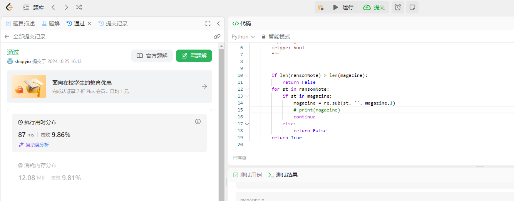
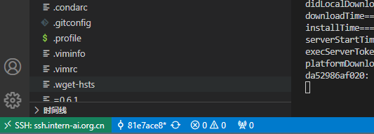
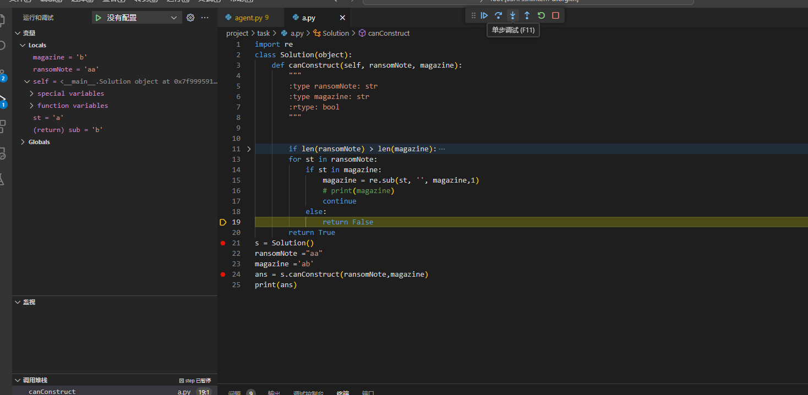

### 任务一


完成[Leetcode 383](https://leetcode.cn/problems/ransom-note/description/), 笔记中提交代码与leetcode提交通过截图

代码

```python
class Solution(object):
    def canConstruct(self, ransomNote, magazine):
        """
        :type ransomNote: str
        :type magazine: str
        :rtype: bool
        """ 
        
        
        if len(ransomNote) > len(magazine):
            return False
        for st in ransomNote:
            if st in magazine:
                magazine = re.sub(st, '', magazine,1)
                # print(magazine)
                continue
            else:
                return False
        return True
```

思路：遍历所有字符，若遇到相同的则抛出匹配的字符串，直至结束。




### 任务二


使用VScode连接开发机，用任务一的代码走一遍debug的流程并做笔记



debug



1. **设置断点**：在 s实例中设置了断点，方便检查每一步执行情况。

2. **启动调试**：在使用调试配置文件启动调试模式，并成功在断点处暂停。

3. **检查变量**：在调试过程中，使用调试控制台检查了变量 `st` 和 `magazine ` 的值，确保匹配和抛出正确。

4. **问题解决**：在测试过程中发现一个问题：正则表达式没有考虑到两个字段的长度问题， 后加入判断解决。

5. **最终结果**：调试完成后，程序正确统计每个单词的出现次数，并输出预期结果。