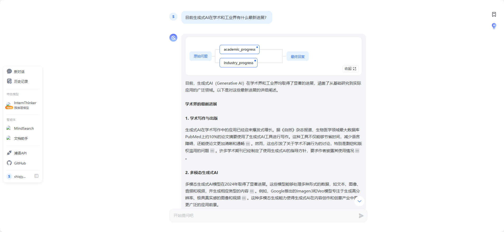
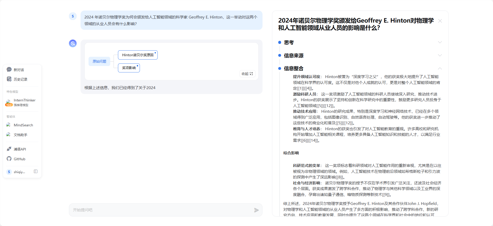
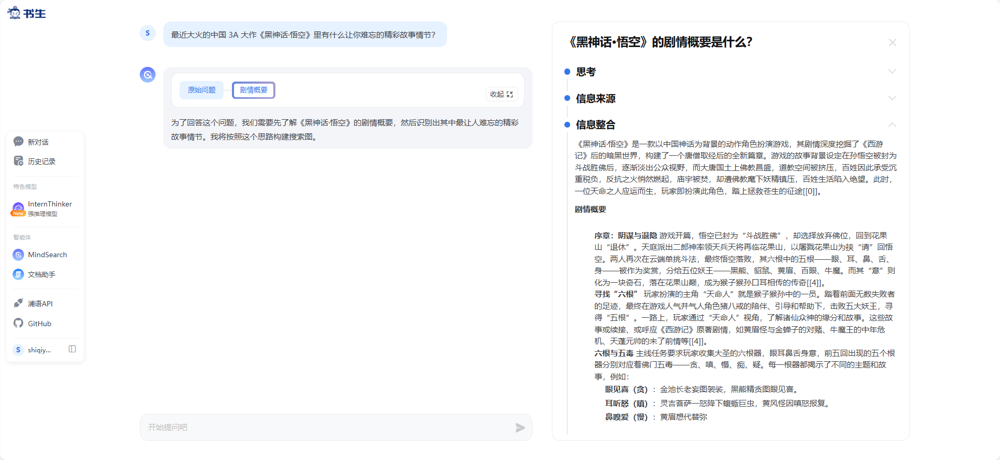
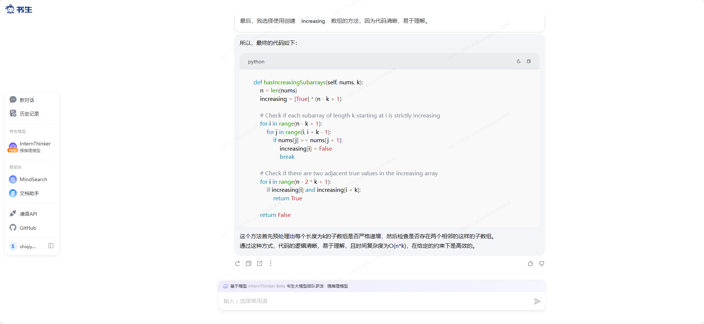
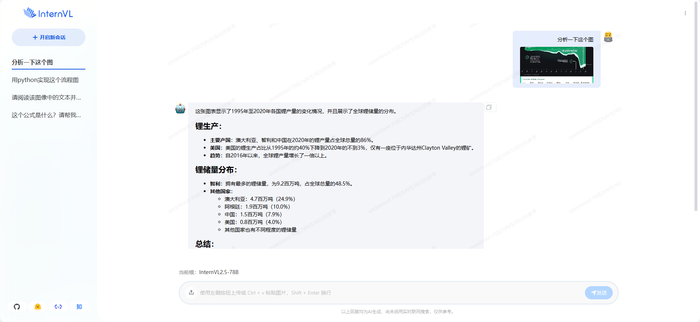

# 玩转书生「多模态对话」与「AI搜索」产品 - 任务

# **基础任务**

使用 **MindSearch** 在以下三个问题中选择一个你感兴趣的进行提问

1. 目前生成式AI在学术和工业界有什么最新进展？

   

2. 2024 年诺贝尔物理学奖为何会颁发给人工智能领域的科学家 Geoffrey E. Hinton，这一举动对这两个领域的从业人员会有什么影响？

   

3. 最近大火的中国 3A 大作《黑神话·悟空》里有什么让你难忘的精彩故事情节？

   

书生·浦语 **InternLM** 开源模型官方的对话类产品

[书生·万象](https://internvl.opengvlab.com/)
InternVL 开源的视觉语言模型官方的对话产品

