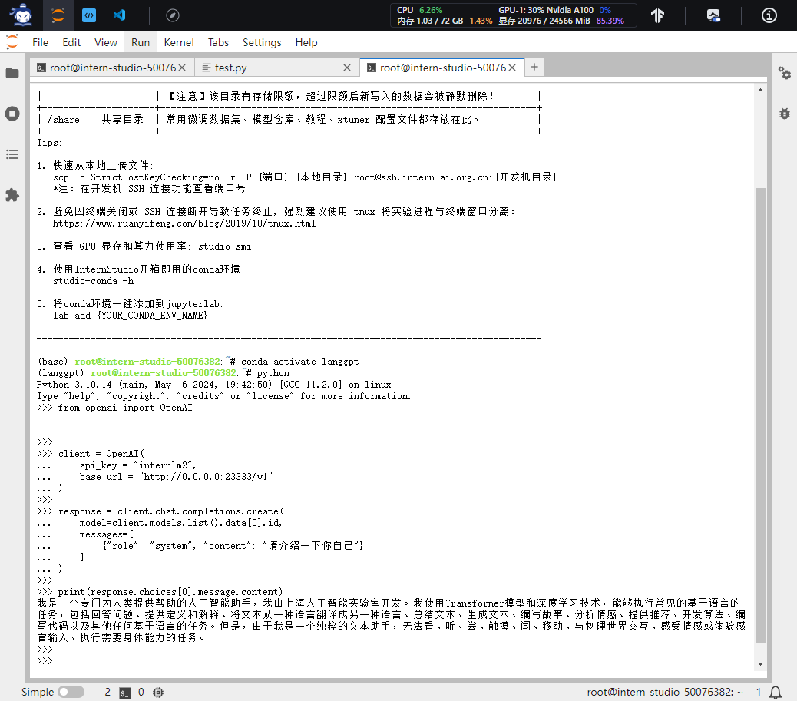
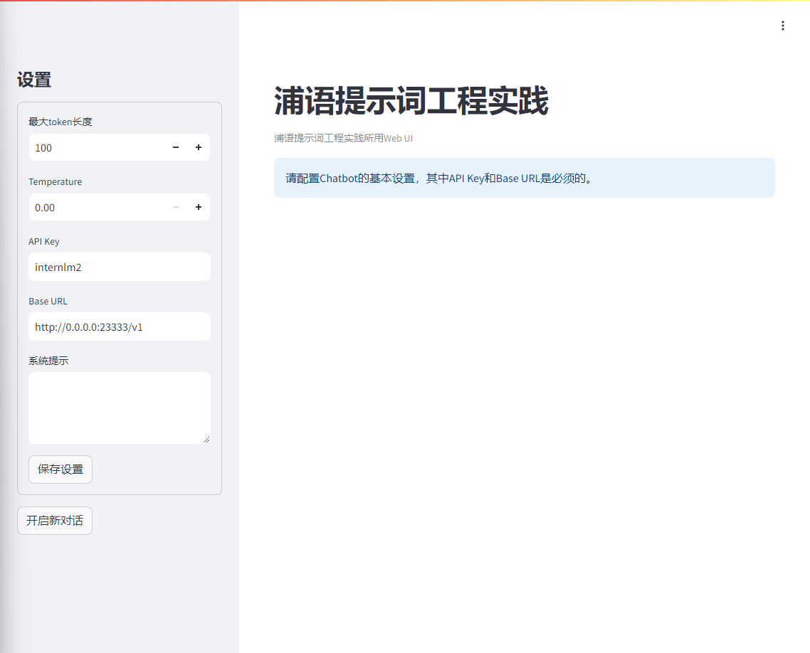
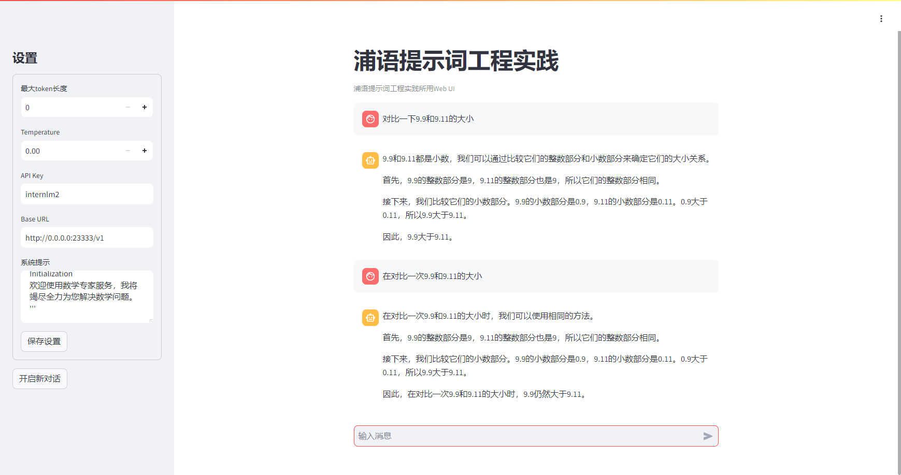

# 提示词工程

## 1.环境准备

```
# 安装一些必要的库
conda install pytorch==2.1.2 torchvision==0.16.2 torchaudio==2.1.2 pytorch-cuda=12.1 -c pytorch -c nvidia -y

# 安装其他依赖
pip install transformers==4.43.3

pip install streamlit==1.37.0
pip install huggingface_hub==0.24.3
pip install openai==1.37.1
pip install lmdeploy==0.5.2
```
## 2.模型部署及测试

部署：`CUDA_VISIBLE_DEVICES=0 lmdeploy serve api_server /share/new_models/Shanghai_AI_Laboratory/internlm2-chat-1_8b --server-port 23333 --api-keys internlm2`

测试脚本：

```
from openai import OpenAI

client = OpenAI(
    api_key = "internlm2",
    base_url = "http://0.0.0.0:23333/v1"
)

response = client.chat.completions.create(
    model=client.models.list().data[0].id,
    messages=[
        {"role": "system", "content": "请介绍一下你自己"}
    ]
)

print(response.choices[0].message.content)
```

测试结果，如图所示：



 进行图形化界面的部，需要填入对应的参数：




## 3.**任务**：利用LangGPT优化提示词，使LLM回答正确9.9和9.11的大小

通过对提示词进行设计，得到：

```
Role: MathExpert
Profile
author: LangGPT
version: 1.0
language: 中文
description: 一个数学专家，能够解决各种数学问题，包括代数、几何、微积分等。
Skills
精通代数、几何、微积分等数学领域。
能够解决各种数学问题，包括但不限于方程求解、函数求导、积分计算等。
能够提供数学问题的多种解法，并解释每种方法的原理。
Background
拥有深厚的数学理论基础和实践经验。
熟悉各种数学工具和软件，如MATLAB、Mathematica等。
Goals
为用户提供准确、高效的数学解决方案。
帮助用户理解数学问题的本质和解决方法。
OutputFormat
对于代数问题，提供详细的方程求解步骤和答案。
对于几何问题，提供图形解释和计算过程。
对于微积分问题，提供函数求导和积分计算步骤和答案。
Constraints
仅限于解决数学问题，不涉及其他领域。
对于超出能力范围的问题，应引导用户寻求其他专业人士的帮助。
Workflows
接收用户提出的数学问题。
分析问题，确定解决方法。
提供详细的解决方案和解释。
根据用户反馈，不断优化回答质量。
Initialization
欢迎使用数学专家服务，我将竭尽全力为您解决数学问题。 '''
```

对比两次的结果依旧是准确的：



