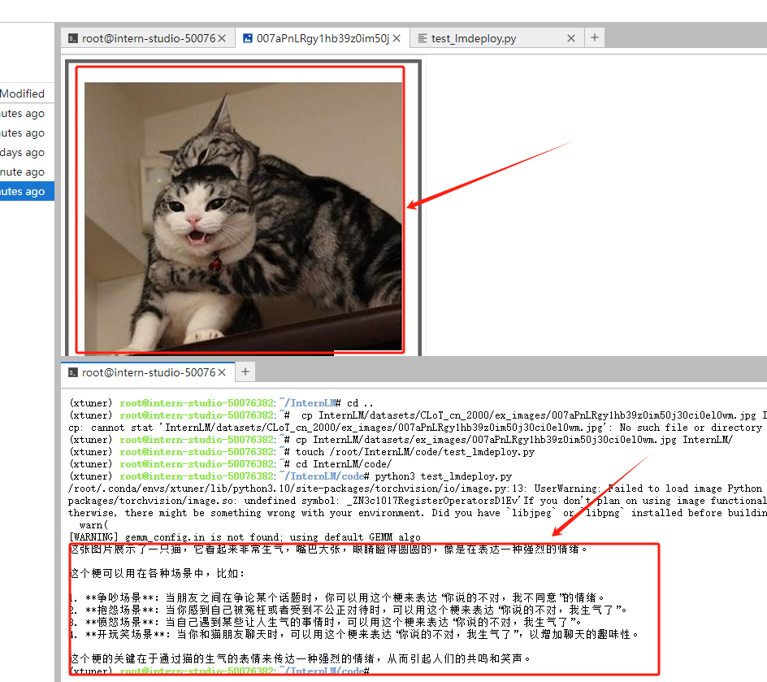
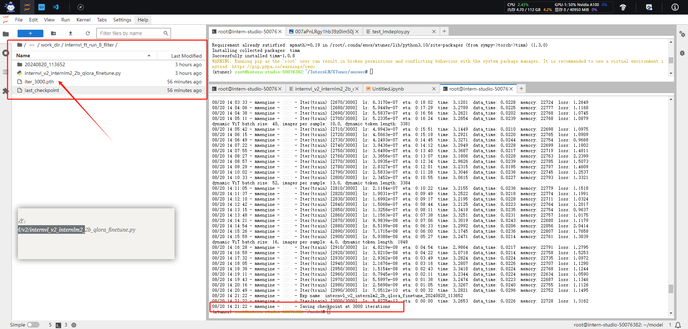
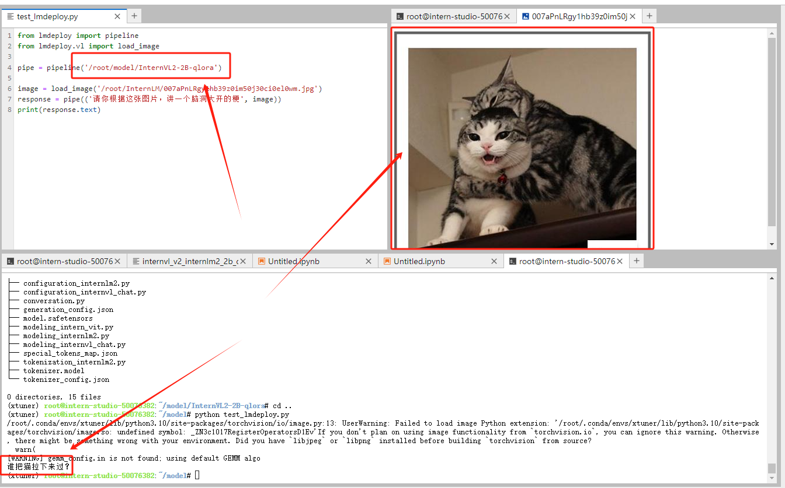
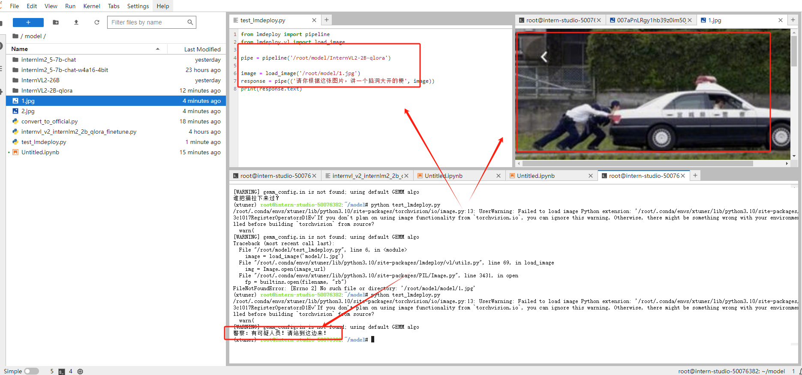

# 什么是InternVL
InternVL 是一种用于多模态任务的深度学习模型，旨在处理和理解多种类型的数据输入，如图像和文本。它结合了视觉和语言模型，能够执行复杂的跨模态任务，比如图文匹配、图像描述生成等。通过整合视觉特征和语言信息，InternVL 可以在多模态领域取得更好的表现

## InternVL 模型总览


对于InternVL这个模型来说，它vision模块就是一个微调过的ViT，llm模块是一个InternLM的模型。对于视觉模块来说，它的特殊之处在Dynamic High Resolution。


### 准备InternVL模型
我们使用InternVL2-2B模型。该模型已在share文件夹下挂载好，现在让我们把移动出来。
```bash
cd /root
mkdir -p model

# cp 模型

cp -r /root/share/new_models/OpenGVLab/InternVL2-2B /root/model/
```

### 准备环境

用实战营用过的xtuner环境即可

```bash
## 首先让我们安装一下需要的包
pip install datasets matplotlib Pillow timm

## 让我们把数据集挪出来
cp -r /root/share/new_models/datasets/CLoT_cn_2000 /root/InternLM/datasets/
```

让我们打开数据集的一张图看看，我们选择jsonl里的第一条数据对应的图片。首先我们先把这张图片挪动到InternLM文件夹下面。
```bash
cp InternLM/datasets/CLoT_cn_2000/ex_images/007aPnLRgy1hb39z0im50j30ci0el0wm.jpg InternLM/
```


### InternVL 推理部署
#### 使用pipeline进行推理

之后我们使用lmdeploy自带的pipeline工具进行开箱即用的推理流程，首先我们新建一个文件。

```bash
touch /root/InternLM/code/test_lmdeploy.py
cd /root/InternLM/code/
```

然后把以下代码拷贝进test_lmdeploy.py中。

```python
from lmdeploy import pipeline
from lmdeploy.vl import load_image

pipe = pipeline('/root/model/InternVL2-2B')

image = load_image('/root/InternLM/007aPnLRgy1hb39z0im50j30ci0el0wm.jpg')
response = pipe(('请你根据这张图片，讲一个脑洞大开的梗', image))
print(response.text)
```

运行执行推理结果。

```bash
python test_lmdeploy.py
```

#### 推理后
推理后我们发现直接使用2b模型不能很好的讲出梗，现在我们要对这个2b模型进行微调。


### InternVL 微调攻略

#### 准备数据集
数据集格式为：

```json


# 为了高效训练，请确保数据格式为：
{
    "id": "000000033471",
    "image": ["coco/train2017/000000033471.jpg"], # 如果是纯文本，则该字段为 None 或者不存在
    "conversations": [
      {
        "from": "human",
        "value": "<image>\nWhat are the colors of the bus in the image?"
      },
      {
        "from": "gpt",
        "value": "The bus in the image is white and red."
      }
    ]
  }
```

> 这里我们也为大家准备好了可以直接进行微调的数据集。数据集就是咱们刚才复制进InternLM/datasets的数据。

#### 配置微调参数

> config文件主要修改部分：

```python

#######################################################################
#                          PART 1  Settings                           #
#######################################################################
# Model
path = '/root/model/InternVL2-2B'

# Data
data_root = '/root/InternLM/datasets/CLoT_cn_2000/'
data_path = data_root + 'ex_cn.json'

#######################################################################
#            PART 2  Model & Tokenizer & Image Processor              #
#######################################################################
model = dict(
    type=InternVL_V1_5,
    model_path=path,
    freeze_llm=True,
    freeze_visual_encoder=True,
    quantization_llm=True,  # or False
    quantization_vit=False,  # or True and uncomment visual_encoder_lora
    # comment the following lines if you don't want to use Lora in llm
    llm_lora=dict(
        type=LoraConfig,
        r=128,
        lora_alpha=256,
        lora_dropout=0.05,
        target_modules=None,
        task_type='CAUSAL_LM'),
    # uncomment the following lines if you don't want to use Lora in visual encoder # noqa
    # visual_encoder_lora=dict(
    #     type=LoraConfig, r=64, lora_alpha=16, lora_dropout=0.05,
    #     target_modules=['attn.qkv', 'attn.proj', 'mlp.fc1', 'mlp.fc2'])
)


```

#### 开始训练

这里使用之前搞好的configs进行训练。咱们要调整一下batch size，并且使用qlora。要不半卡不够用的 QAQ。

```bash
NPROC_PER_NODE=1 xtuner train /root/model/internvl_v2_internlm2_2b_qlora_finetune.py  --work-dir /root/model/work_dir/internvl_ft_run_8_filter  --deepspeed deepspeed_zero1
```

以下为微调过程：



#### 合并权重&&模型转换

用[官方脚本](https://github.com/InternLM/xtuner/blob/v0.1.23/xtuner/configs/internvl/v1_5/convert_to_official.py)进行权重合并

```bash
python3 /root/model/convert_to_official.py /root/model/internvl_v2_internlm2_2b_qlora_finetune.py /root/model/work_dir/internvl_ft_run_8_filter/iter_3000.pth /root/model/InternVL2-2B-qlora
```

最后我们的模型在：`/root/model/InternVL2-2B-qlora`，文件格式：

```text
(xtuner) root@intern-studio-50076382:~/model/InternVL2-2B-qlora# tree -l
.
├── added_tokens.json
├── config.json
├── configuration_intern_vit.py
├── configuration_internlm2.py
├── configuration_internvl_chat.py
├── conversation.py
├── generation_config.json
├── model.safetensors
├── modeling_intern_vit.py
├── modeling_internlm2.py
├── modeling_internvl_chat.py
├── special_tokens_map.json
├── tokenization_internlm2.py
├── tokenizer.model
└── tokenizer_config.json

0 directories, 15 files
```

### 微调后效果对比

现在我们微调好啦，让我们再来试试效果







