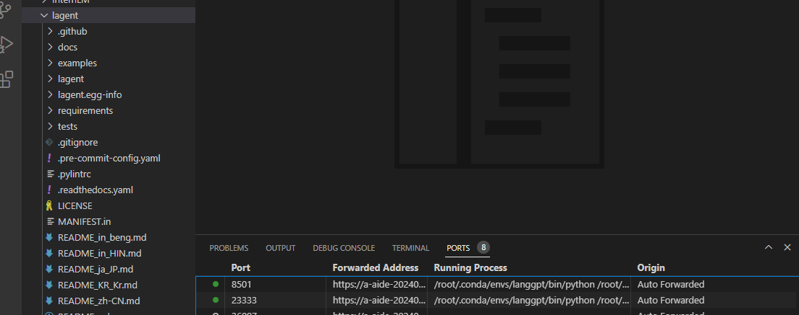
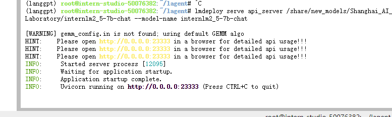
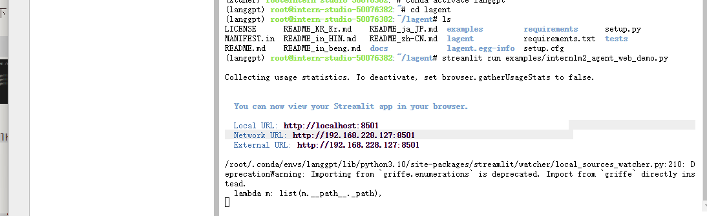
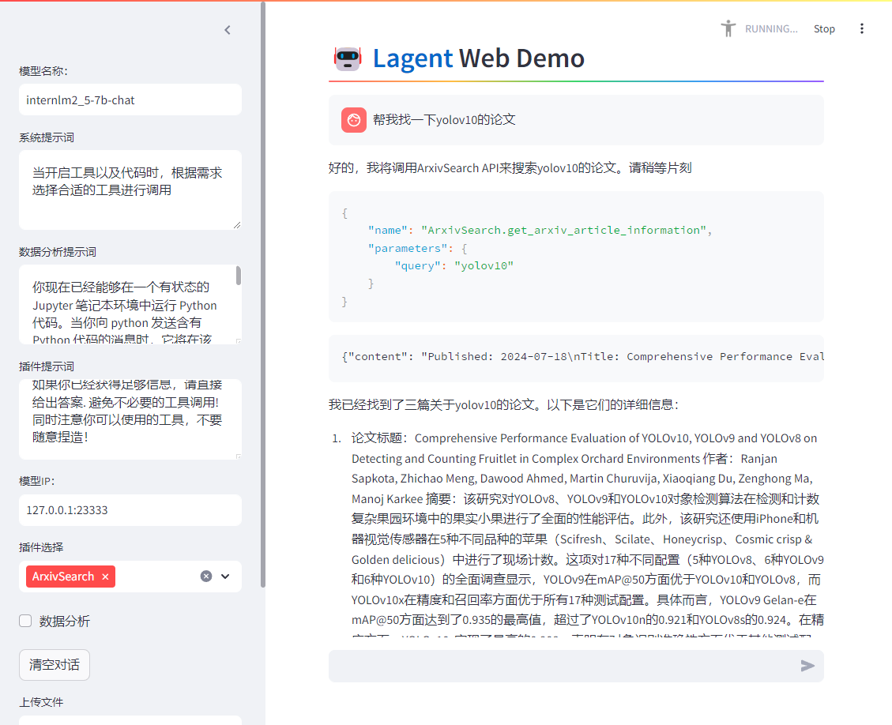
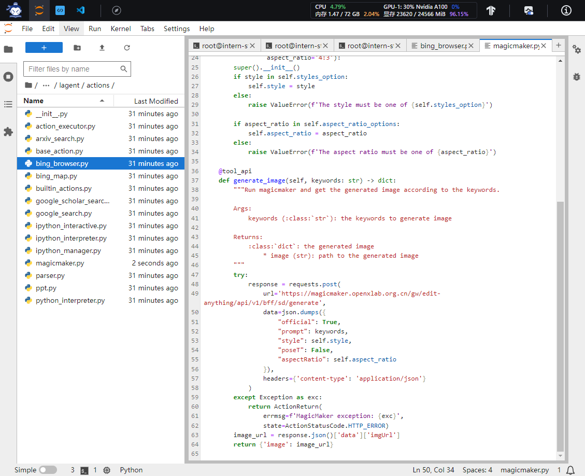
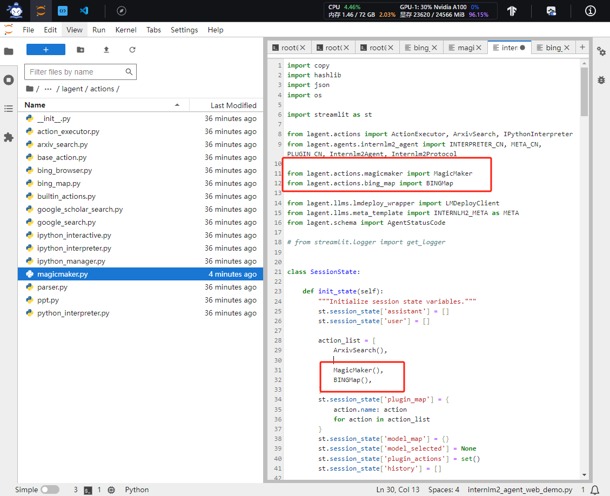
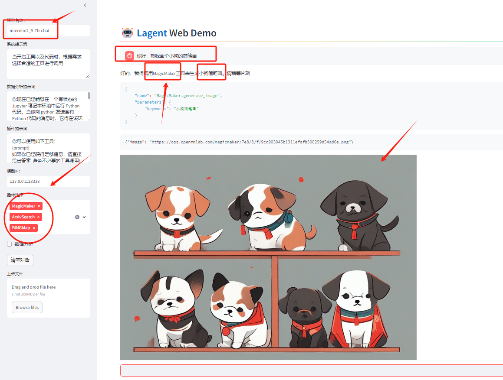
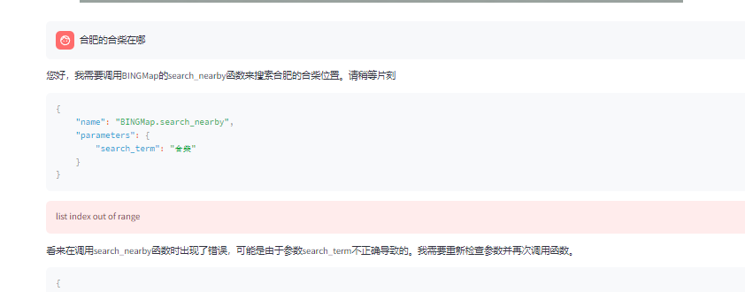

# Lagent ：自定义 Agent 智能体

## 介绍

Lagent 是一个轻量级开源智能体框架，旨在让用户可以高效地构建基于大语言模型的智能体。同时它也提供了一些典型工具以增强大语言模型的能力。

## 环境配置

开发机选择 30% A100，镜像选择为 Cuda12.2-conda。

```bash
#直接使用上一个任务的环境
# 激活环境
conda activate langgpt

```

接下来，我们通过源码安装的方式安装 lagent。

```bash
# 在root目录下
git clone https://github.com/InternLM/lagent.git
cd lagent && git checkout 81e7ace && pip install -e . && cd ..
```

## Lagent Web Demo 使用

接下来，我们将使用 Lagent 的 Web Demo 来体验 InternLM2.5-7B-Chat 的智能体能力。

首先，我们先使用 LMDeploy 部署 InternLM2.5-7B-Chat，并启动一个 API Server。

```bash
conda activate langgpt
lmdeploy serve api_server /share/new_models/Shanghai_AI_Laboratory/internlm2_5-7b-chat --model-name internlm2_5-7b-chat
```

然后，我们在另一个窗口中启动 Lagent 的 Web Demo。

```bash
cd /root/lagent
conda activate langgpt
streamlit run examples/internlm2_agent_web_demo.py
```



在等待两个 server 都完全启动（如下图所示）后，使用**vscode**自动进行端口映射：

|  |  |
| ------------------------------------------------------- | ------------------------------------------------------- |


接下来，在本地浏览器中打开 `localhost:8501`，并修改**模型名称**一栏为 `internlm2_5-7b-chat`，修改**模型 ip**一栏为`127.0.0.1:23333`。

**输入后需要按下回车以确认**

然后，我们在插件选择一栏选择 `ArxivSearch`，并输入指令“帮我找一下yolov10 的论文”。

以下为回复：




## 基于 Lagent 自定义智能体

使用 Lagent 自定义工具主要分为以下几步：

1. 继承 `BaseAction` 类
2. 实现简单工具的 `run` 方法；或者实现工具包内每个子工具的功能
3. 简单工具的 `run` 方法可选被 `tool_api` 装饰；工具包内每个子工具的功能都需要被 `tool_api` 装饰

下面我们将实现一个调用 MagicMaker API 以完成文生图的功能。

首先，我们先来创建工具文件：

```bash
cd /root/agent_camp3/lagent
touch lagent/actions/magicmaker.py
```

然后，我们将下面的代码复制进入 `/root/agent_camp3/lagent/lagent/actions/magicmaker.py`



最后，我们修改 `/root/lagent/examples/internlm2_agent_web_demo.py` 来适配我们的自定义工具。

1. 在 `from lagent.actions import ActionExecutor, ArxivSearch, IPythonInterpreter` 的下一行添加 `from lagent.actions.magicmaker import MagicMaker`以及`from lagent.actions.bing_map import BINGMap`
2. 在第27行添加 `MagicMaker()`和`BINGMap()`。
2. 其中BING_MAP_KEY 需要导入。



接下来，重新启动 Web Demo ！我们同时启用三个工具，然后输入“请帮我生成一幅山水画”




然后，我们再试一下“合肥的合柴在哪”。这个Key我还没申请到，后续慢慢研究。


