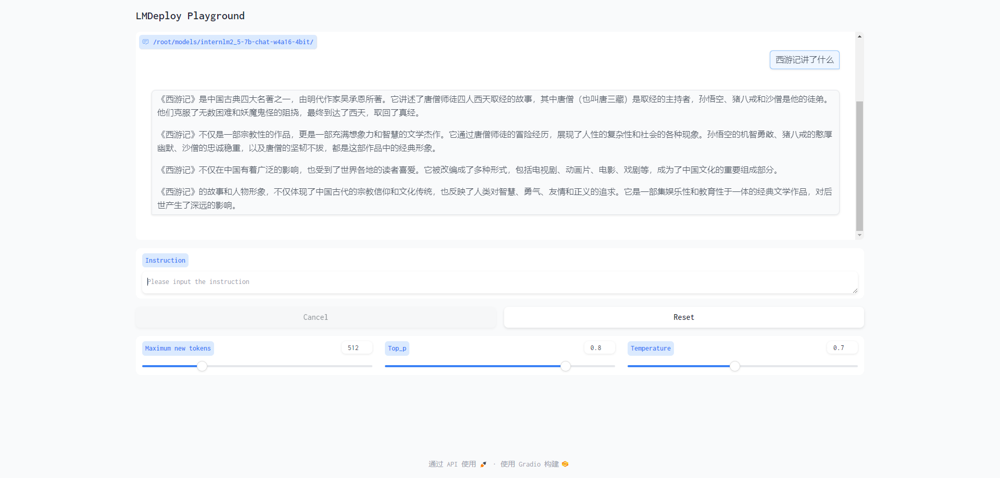

# 0 LMDeploy量化部署任务

**任务完成截图：**

**使用结合W4A16量化与kv cache量化的`internlm2_5-7b-chat`模型封装本地API并与大模型进行一次对话**:



**使用Function call功能让大模型完成一次简单的"加"与"乘"函数调用**


我们可以看出InternLM2.5将输入`'Compute (3+5)*2'`根据提供的function拆分成了"加"和"乘"两步，第一步调用`function add`实现加，再于第二步调用`function mul`实现乘，再最终输出结果16.

# 1 配置环境

直接使用上次的langgpt环境，里面已安装lmdeploy。

获取模型

为方便文件管理，我们需要一个存放模型的目录，统一放置在`/root/models/`目录。

运行以下命令，创建文件夹并设置开发机共享目录的软链接。

```Plain
mkdir /root/models
ln -s /root/share/new_models//Shanghai_AI_Laboratory/internlm2_5-7b-chat /root/models
ln -s /root/share/new_models/OpenGVLab/InternVL2-26B /root/models
```

此时，我们可以看到`/root/models`中会出现`internlm2_5-7b-chat`和`InternVL2-26B`文件夹。

激活`langgpt`环境：


## 1.3 LMDeploy验证启动模型文件

在量化工作正式开始前，我们还需要验证一下获取的模型文件能否正常工作.

让我们进入创建好的conda环境并启动InternLM2_5-7b-chat！

```Plain
conda activate langgpt
lmdeploy chat /root/models/internlm2_5-7b-chat
```

稍待片刻，启动成功后，会显示如下。


此时，我们可以在CLI(“命令行界面” Command Line Interface的缩写)中和InternLM2.5尽情对话了，注意输入内容完成后需要按**两次回车**才能够执行，以下为示例。


##  2.1 LMDeploy API部署InternLM2.5

直接在本地部署InternLM2.5，将大模型封装为API接口服务，客户端访问。

### 2.1.1 启动API服务器

首先让我们进入创建好的conda环境，并通下命令启动API服务器，部署InternLM2.5模型：

```Plain
conda activate lmdeploy
lmdeploy serve api_server \
    /root/models/internlm2_5-7b-chat \
    --model-format hf \
    --quant-policy 0 \
    --server-name 0.0.0.0 \
    --server-port 23333 \
    --tp 1
```

命令解释：

1. `lmdeploy serve api_server`：这个命令用于启动API服务器。
2. `/root/models/internlm2_5-7b-chat`：这是模型的路径。
3. `--model-format hf`：这个参数指定了模型的格式。`hf`代表“Hugging Face”格式。
4. `--quant-policy 0`：这个参数指定了量化策略。
5. `--server-name 0.0.0.0`：这个参数指定了服务器的名称。在这里，`0.0.0.0`是一个特殊的IP地址，它表示所有网络接口。
6. `--server-port 23333`：这个参数指定了服务器的端口号。在这里，`23333`是服务器将监听的端口号。
7. `--tp 1`：这个参数表示并行数量（GPU数量）。

使用vscode进行端口转发，之后打开浏览器，访问`http://127.0.0.1:23333`看到如下界面即代表部署成功。


### <a id="2.1.2"> 2.1.2 以命令行形式连接API服务器 </a>

关闭`http://127.0.0.1:23333`网页，但保持终端和本地窗口不动，按箭头操作新建一个终端。

运行如下命令，激活conda环境并启动命令行客户端。

```Python
conda activate lmdeploy
lmdeploy serve api_client http://localhost:23333
```

稍待片刻，等出现`double enter to end input >>>`的输入提示即启动成功，此时便可以随意与InternLM2.5对话，同样是两下回车确定，输入`exit`退出。


### <a id="2.1.3"> 2.1.3 以Gradio**网页形式连接API服务器**</a>

保持第一个终端不动，在新建终端中输入`exit`退出。

输入以下命令，使用Gradio作为前端，启动网页。

```Python
lmdeploy serve gradio http://localhost:23333 \
    --server-name 0.0.0.0 \
    --server-port 6006
```

通过vscode进行端口转发，即可访问地址`http://127.0.0.1:6006`，与模型尽情对话了。


## 2.2 LMDeploy Lite

随着模型变得越来越大，我们需要一些大模型压缩技术来降低模型部署的成本，并提升模型的推理性能。LMDeploy 提供了权重量化和 k/v cache两种策略。

### 2.2.1 设置**在线** kv cache int4/int8 量化

自 v0.4.0 起，LMDeploy 支持在线 kv cache int4/int8 量化，量化方式为 per-head per-token 的非对称量化。此外，通过 LMDeploy 应用 kv 量化非常简单，只需要设定 `quant_policy` 和`cache-max-entry-count`参数。目前，LMDeploy 规定 `qant_policy=4` 表示 kv int4 量化，`quant_policy=8` 表示 kv int8 量化。

输入以下指令，启动API服务器。

```Python
lmdeploy serve api_server \
    /root/models/internlm2_5-7b-chat \
    --model-format hf \
    --quant-policy 4 \
    --cache-max-entry-count 0.4\
    --server-name 0.0.0.0 \
    --server-port 23333 \
    --tp 1
```

稍待片刻，显示如下即代表服务启动成功。


### 2.2.2 W4A16 模型量化和部署

准确说，模型量化是一种优化技术，旨在减少机器学习模型的大小并提高其推理速度。量化通过将模型的权重和激活从高精度（如16位浮点数）转换为低精度（如8位整数、4位整数、甚至二值网络）来实现。

那么标题中的W4A16又是什么意思呢？

- W4：这通常表示权重量化为4位整数（int4）。这意味着模型中的权重参数将从它们原始的浮点表示（例如FP32、BF16或FP16，**Internlm2.5精度为BF16**）转换为4位的整数表示。这样做可以显著减少模型的大小。
- A16：这表示激活（或输入/输出）仍然保持在16位浮点数（例如FP16或BF16）。激活是在神经网络中传播的数据，通常在每层运算之后产生。

因此，W4A16的量化配置意味着：

- 权重被量化为4位整数。
- 激活保持为16位浮点数。

让我们回到LMDeploy，在最新的版本中，LMDeploy使用的是AWQ算法，能够实现模型的4bit权重量化。输入以下指令，执行量化工作。`batch-size`可适当设置大一点，次数设为 `10`

```Python
lmdeploy lite auto_awq \
   /root/models/internlm2_5-7b-chat \
  --calib-dataset 'ptb' \
  --calib-samples 128 \
  --calib-seqlen 2048 \
  --w-bits 4 \
  --w-group-size 128 \
  --batch-size 10 \
  --search-scale False \
  --work-dir /root/models/internlm2_5-7b-chat-w4a16-4bit
```

输入以下指令启动量化后的模型。

```Python
lmdeploy chat /root/models/internlm2_5-7b-chat-w4a16-4bit/ --model-format awq
```


### 2.2.3  W4A16 量化+ KV cache+KV cache 量化

输入以下指令，让我们同时启用量化后的模型、设定kv cache占用和kv cache int4量化。

```Python
lmdeploy serve api_server \
    /root/models/internlm2_5-7b-chat-w4a16-4bit/ \
    --model-format awq \
    --quant-policy 4 \
    --cache-max-entry-count 0.4\
    --server-name 0.0.0.0 \
    --server-port 23333 \
    --tp 1
```

调用效果：


# 3 Function call

##  Function call

关于Function call，即函数调用功能，它允许开发者在调用模型时，详细说明函数的作用，并使模型能够智能地根据用户的提问来输入参数并执行函数。完成调用后，模型会将函数的输出结果作为回答用户问题的依据。

首先让我们进入创建好的conda环境并启动API服务器。

```Plain
conda activate lmdeploy
lmdeploy serve api_server \
    /root/models/internlm2_5-7b-chat \
    --model-format hf \
    --quant-policy 0 \
    --server-name 0.0.0.0 \
    --server-port 23333 \
    --tp 1
```

目前LMDeploy在0.5.3版本中支持了对InternLM2, InternLM2.5和llama3.1这三个模型，故我们选用InternLM2.5 封装API。

让我们使用一个简单的例子作为演示。输入如下指令，新建`internlm2_5_func.py`。

```Plain
touch /root/internlm2_5_func.py
```

双击打开，并将以下内容复制粘贴进`internlm2_5_func.py`。

```Python
from openai import OpenAI


def add(a: int, b: int):
    return a + b


def mul(a: int, b: int):
    return a * b


tools = [{
    'type': 'function',
    'function': {
        'name': 'add',
        'description': 'Compute the sum of two numbers',
        'parameters': {
            'type': 'object',
            'properties': {
                'a': {
                    'type': 'int',
                    'description': 'A number',
                },
                'b': {
                    'type': 'int',
                    'description': 'A number',
                },
            },
            'required': ['a', 'b'],
        },
    }
}, {
    'type': 'function',
    'function': {
        'name': 'mul',
        'description': 'Calculate the product of two numbers',
        'parameters': {
            'type': 'object',
            'properties': {
                'a': {
                    'type': 'int',
                    'description': 'A number',
                },
                'b': {
                    'type': 'int',
                    'description': 'A number',
                },
            },
            'required': ['a', 'b'],
        },
    }
}]
messages = [{'role': 'user', 'content': 'Compute (3+5)*2'}]

client = OpenAI(api_key='YOUR_API_KEY', base_url='http://0.0.0.0:23333/v1')
model_name = client.models.list().data[0].id
response = client.chat.completions.create(
    model=model_name,
    messages=messages,
    temperature=0.8,
    top_p=0.8,
    stream=False,
    tools=tools)
print(response)
func1_name = response.choices[0].message.tool_calls[0].function.name
func1_args = response.choices[0].message.tool_calls[0].function.arguments
func1_out = eval(f'{func1_name}(**{func1_args})')
print(func1_out)

messages.append({
    'role': 'assistant',
    'content': response.choices[0].message.content
})
messages.append({
    'role': 'environment',
    'content': f'3+5={func1_out}',
    'name': 'plugin'
})
response = client.chat.completions.create(
    model=model_name,
    messages=messages,
    temperature=0.8,
    top_p=0.8,
    stream=False,
    tools=tools)
print(response)
func2_name = response.choices[0].message.tool_calls[0].function.name
func2_args = response.choices[0].message.tool_calls[0].function.arguments
func2_out = eval(f'{func2_name}(**{func2_args})')
print(func2_out)
```

运行python代码。

```Python
python /root/internlm2_5_func.py
```

稍待片刻终端输出如下。


我们可以看出InternLM2.5将输入`'Compute (3+5)*2'`根据提供的function拆分成了"加"和"乘"两步，第一步调用`function add`实现加，再于第二步调用`function mul`实现乘，再最终输出结果16.