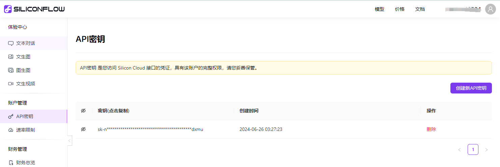
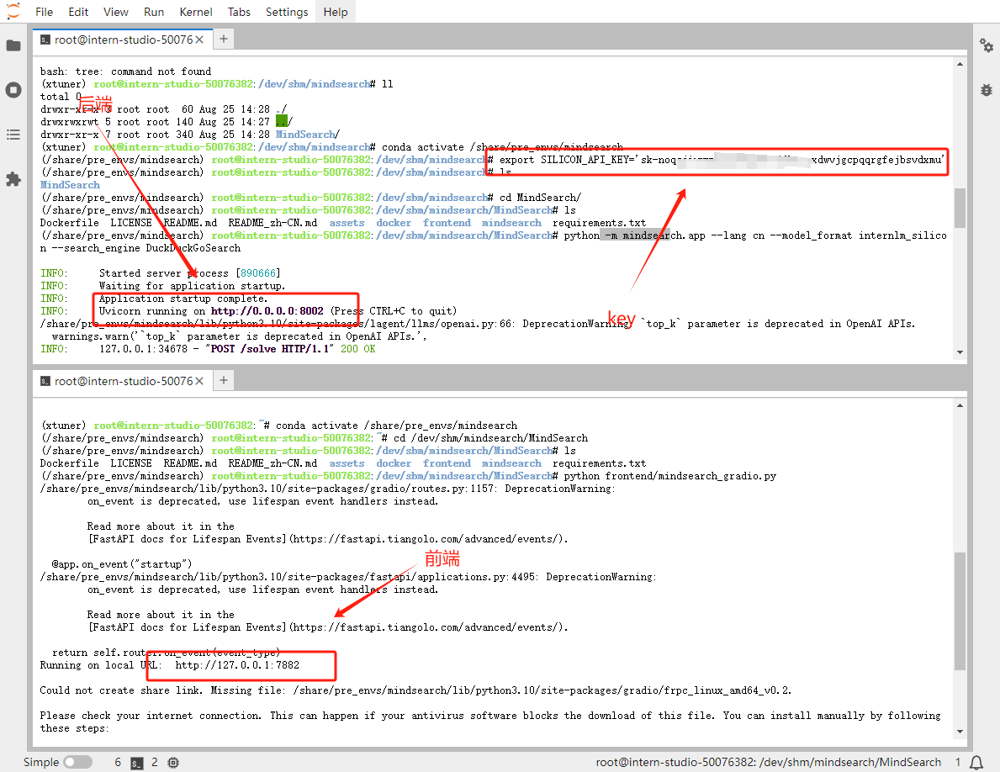
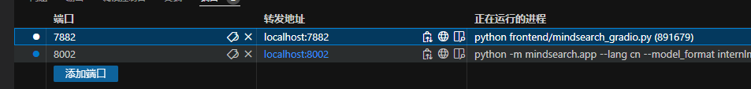
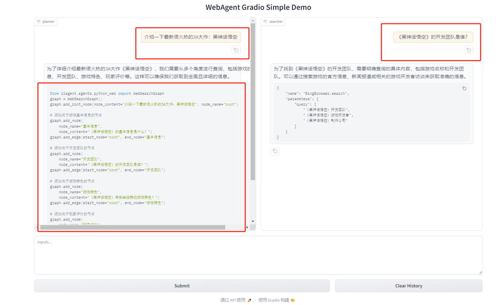
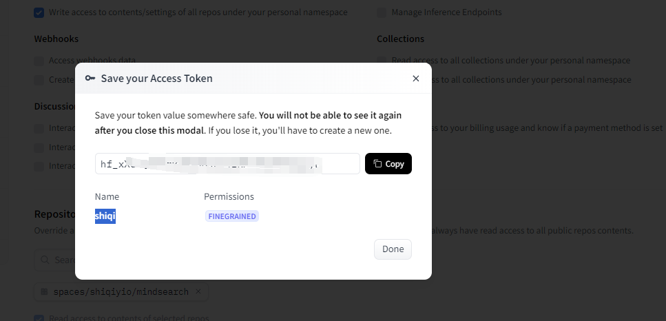
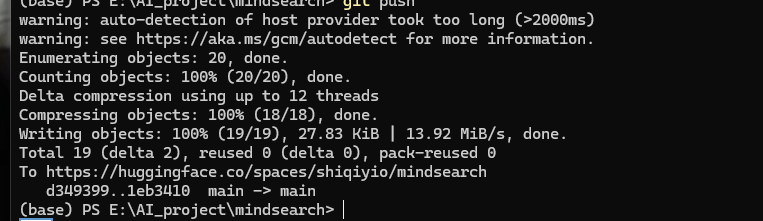
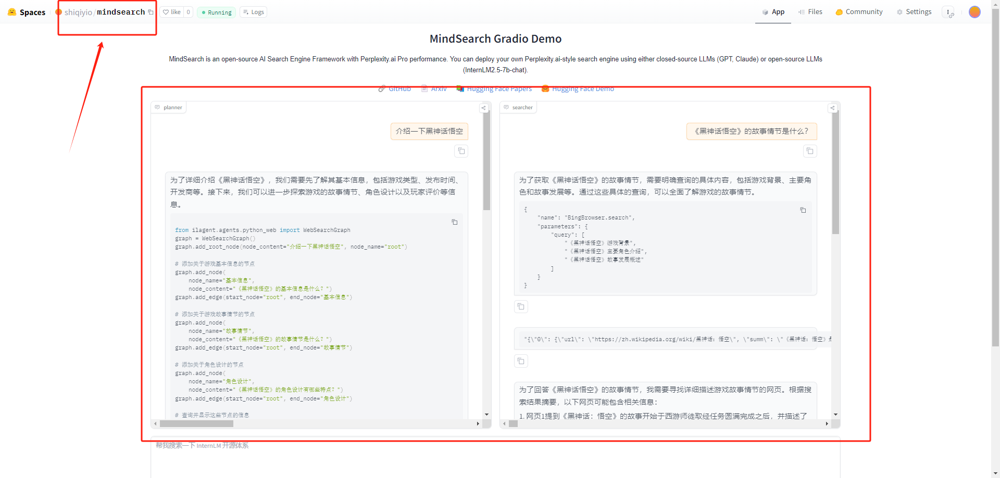

# MindSearch CPU-only 版部署
[huggingface体验地址](https://huggingface.co/spaces/shiqiyio/mindsearch)！！！！！

用 InternStudio 算力平台来部署 CPU-only 的 MindSearch 。

## 1. 创建开发机 & 环境配置

打开开发机，新建一个目录用于存放 MindSearch 的相关代码，并把 MindSearch 仓库 clone 下来。

```bash
mkdir -p /root/mindsearch
cd /root/mindsearch
git clone https://github.com/InternLM/MindSearch.git
cd MindSearch && git checkout b832275 && cd ..
```

接下来，我们激活已有的 conda 环境。

```bash

# 激活环境
conda activate /share/pre_envs/mindsearch

```

## 2. 获取硅基流动 API Key

因为要使用硅基流动的 API Key，所以接下来便是注册并获取 API Key 了。

首先，我们打开 https://account.siliconflow.cn/login 来注册硅基流动的账号（如果注册过，则直接登录即可）。

在完成注册后，打开 https://cloud.siliconflow.cn/account/ak 来准备 API Key。首先创建新 API 密钥，然后点击密钥进行复制，以备后续使用。



## 3. 启动 MindSearch

### 3.1 启动后端

由于硅基流动 API 的相关配置已经集成在了 MindSearch 中，所以我们可以直接执行下面的代码来启动 MindSearch 的后端。

```bash
export SILICON_API_KEY=第二步中复制的密钥
conda activate mindsearch
cd /root/mindsearch/MindSearch
python -m mindsearch.app --lang cn --model_format internlm_silicon --search_engine DuckDuckGoSearch
```

### 3.2 启动前端

在后端启动完成后，我们打开新终端运行如下命令来启动 MindSearch 的前端。

```bash
conda activate mindsearch
cd /root/mindsearch/MindSearch
python frontend/mindsearch_gradio.py
```



最后，我们把 8002 端口和 7882 端口都映射到本地。可以在**本地**的 powershell 中执行如下代码：



然后，我们在**本地**浏览器中打开 `localhost:7882` 即可体验啦。



如果遇到了 timeout 的问题，可以按照 [文档](./readme_gpu.md#2-使用-bing-的接口) 换用 Bing 的搜索接口。

## 4. 部署到 HuggingFace Space


在输入 Space name 并选择 License 后，选择配置如下所示。


然后，我们进入 Settings，配置硅基流动的 API Key。如下图所示。


选择 New secrets，name 一栏输入 SILICON_API_KEY，value 一栏输入你的 API Key 的内容。

最后，我们先新建一个目录，准备提交到 HuggingFace Space 的全部文件。

```bash
# 创建新目录
mkdir -p /dev/shm/mindsearch/mindsearch_deploy
# 准备复制文件
cd /dev/shm/mindsearch
cp -r /dev/shm/mindsearch/MindSearch/mindsearch /dev/shm/mindsearch/mindsearch_deploy
cp /dev/shm/mindsearch/MindSearch/requirements.txt /dev/shm/mindsearch/mindsearch_deploy
# 创建 app.py 作为程序入口
touch /dev/shm/mindsearch/mindsearch_deploy/app.py
```

其中，内容见[app.py](./mindsearch/app.py) 


在最后，将mindsearch_deploy 目录下的文件（使用 git）提交到 HuggingFace Space 即可完成部署了。

值得注意的是：在push的时候需要验证token，需要提前配置：






应用运行结果：
