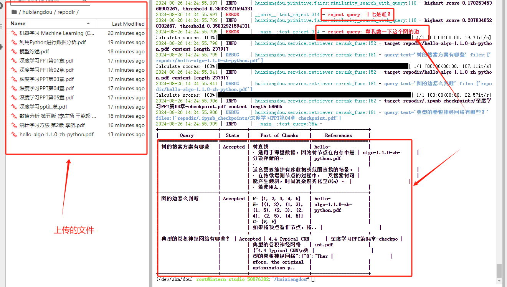
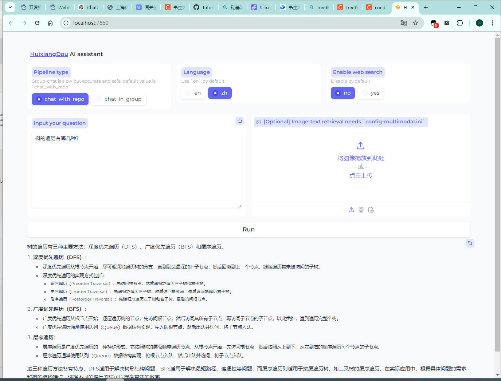
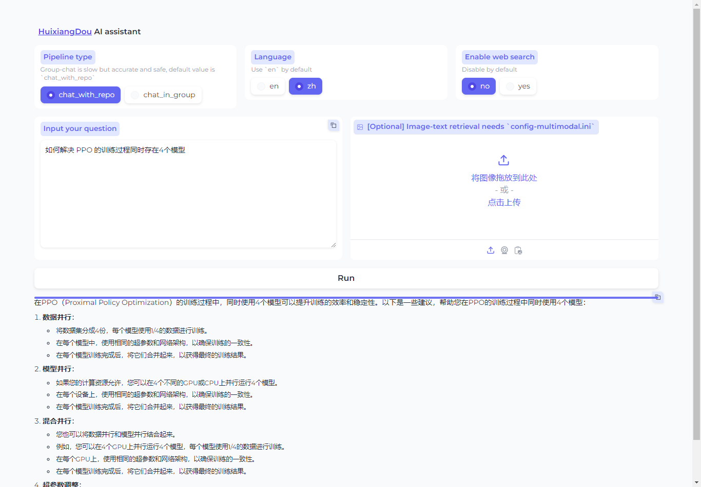
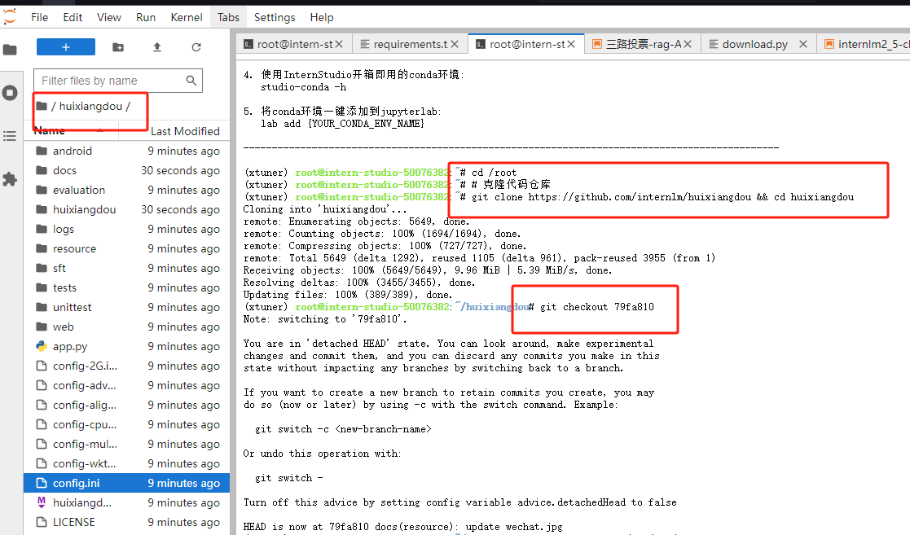
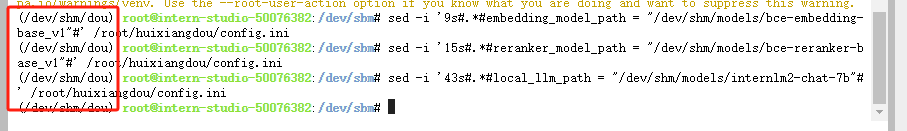
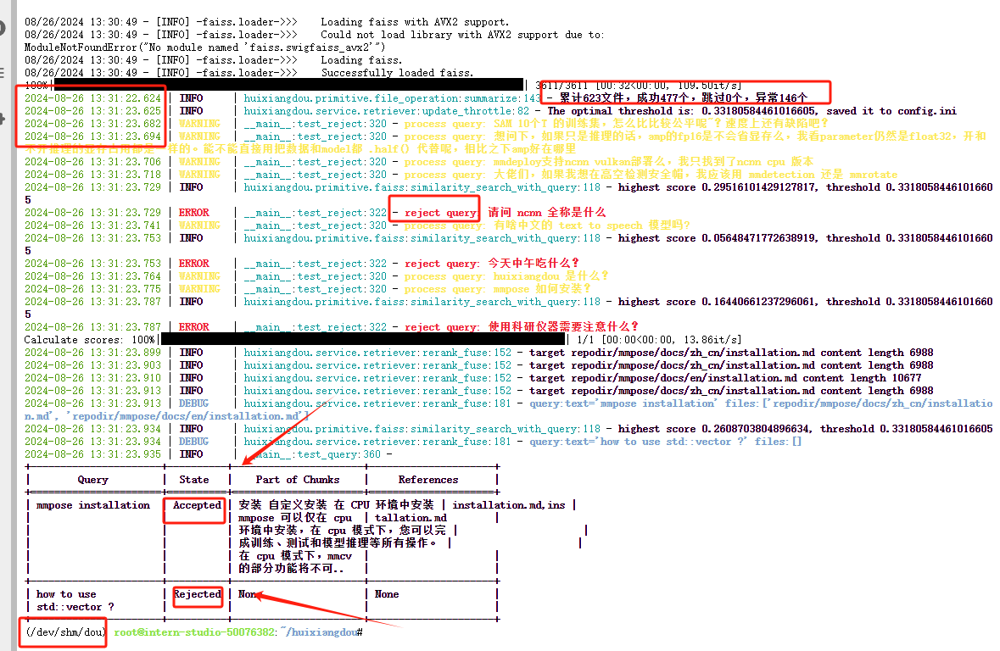

# 1. 茴香豆本地标准版搭建

用自定义文件，构建数据库，并构建正反例：



 Gradio 界面完成 2 轮问答：





## 1.1  安装茴香豆

下面开始茴香豆本地标准版的安装。

### 1.1.1 下载茴香豆

先从茴香豆仓库拉取代码到服务器：

```bash
cd /root
# 克隆代码仓库
git clone https://github.com/internlm/huixiangdou && cd huixiangdou
git checkout 79fa810
```

拉取完成后进入茴香豆文件夹，开始安装。

<div align="center">



</div>

### 1.1.2 安装茴香豆所需依赖

首先安装茴香豆所需依赖：

```bash
conda create -p /dev/shm/dou python=3.8 -y
conda activate /dev/shm/dou
# parsing `word` format requirements
apt update
apt install python-dev libxml2-dev libxslt1-dev antiword unrtf poppler-utils pstotext tesseract-ocr flac ffmpeg lame libmad0 libsox-fmt-mp3 sox libjpeg-dev swig libpulse-dev
# python requirements
pip install BCEmbedding==0.1.5 cmake==3.30.2 lit==18.1.8 sentencepiece==0.2.0 protobuf==5.27.3 accelerate==0.33.0
pip install -r requirements.txt
# python3.8 安装 faiss-gpu 而不是 faiss
```

### 1.1.3 下载模型文件

茴香豆默认会根据配置文件自动下载对应的模型文件，为了节省时间，本次教程所需的模型已经提前下载到服务器中，我们只需要为本次教程所需的模型建立软连接，然后在配置文件中设置相应路径就可以：

```bash
# 创建模型文件夹
cd /dev/shm && mkdir models

# 复制BCE模型
cp -r /root/share/new_models/maidalun1020/bce-embedding-base_v1 /dev/shm/models/bce-embedding-base_v1
cp -r /root/share/new_models/maidalun1020/bce-reranker-base_v1 /dev/shm/models/bce-reranker-base_v1

# 复制大模型参数（下面的模型，根据作业进度和任务进行**选择一个**就行）
cp -r /root/share/new_models/Shanghai_AI_Laboratory/internlm2-chat-7b /dev/shm/models/internlm2-chat-7b
```

完成后可以在相应目录下看到所需模型文件。

<div align="center">

```bash
(/dev/shm/dou) root@intern-studio-50076382:/dev/shm/models# tree -d
.
├── bce-embedding-base_v1
│   ├── 1_Pooling
│   └── assets
├── bce-reranker-base_v1
│   └── assets
└── internlm2-chat-7b
```

</div>

### 1.1.4 更改配置文件

茴香豆的所有功能开启和模型切换都可以通过 `config.ini` 文件进行修改：</div>

执行下面的命令更改配置文件，让茴香豆使用本地模型：

```bash
sed -i '9s#.*#embedding_model_path = "/dev/shm/models/bce-embedding-base_v1"#' /root/huixiangdou/config.ini
sed -i '15s#.*#reranker_model_path = "/dev/shm/models/bce-reranker-base_v1"#' /root/huixiangdou/config.ini
sed -i '43s#.*#local_llm_path = "/dev/shm/models/internlm2-chat-7b"#' /root/huixiangdou/config.ini
```

也可以用编辑器手动修改，文件位置为 `/root/huixiangdou/config.ini`。

修改后的配置文件如下：

<div align="center">



</div>

## 1.2知识库创建

修改完配置文件后，就可以进行知识库的搭建，本次教程选用的是茴香豆和 MMPose 的文档，利用茴香豆搭建一个茴香豆和 MMPose 的知识问答助手。

```bash
conda activate /dev/shm/dou

cd /root/huixiangdou && mkdir repodir

git clone https://github.com/internlm/huixiangdou --depth=1 repodir/huixiangdou
git clone https://github.com/open-mmlab/mmpose    --depth=1 repodir/mmpose

# Save the features of repodir to workdir, and update the positive and negative example thresholds into `config.ini`
mkdir workdir
python3 -m huixiangdou.service.feature_store
```

在 huixiangdou 文件加下创建 repodir 文件夹，用来储存知识库原始文档。再创建一个文件夹 workdir 用来存放原始文档特征提取到的向量知识库。

```bash
(/dev/shm/dou) root@intern-studio-50076382:~/huixiangdou# tree -d -L 2
.
├── android
│   ├── buildsystem
│   ├── demo
│   └── gradle
├── docs
│   └── figures
├── evaluation
│   ├── rejection
│   └── rerank
├── huixiangdou
│   ├── frontend
│   ├── primitive
│   └── service
├── logs
├── repodir
│   ├── huixiangdou
│   └── mmpose
├── resource
│   └── figures
├── sft
│   └── axolotl_configs
├── tests
├── unittest
│   ├── primitive
│   └── service
├── web
│   ├── api
│   ├── config
│   ├── constant
│   ├── front-end
│   ├── middleware
│   ├── model
│   ├── mq
│   ├── orm
│   ├── proxy
│   ├── scheduler
│   ├── service
│   ├── tools
│   └── util
└── workdir

40 directories
```



知识库创建成功后会有一系列小测试，检验问题拒答和响应效果，如图所示，关于“mmpose 安装”的问题，测试结果可以很好的反馈相应答案和对应的参考文件，但关于“std：：vector 使用”的问题，因为属于 C++ 范畴，不再在知识库范围内，测试结果显示拒答，说明我们的知识助手工作正常。

和 Web 版一样，本地版也可以通过编辑正反例来调整茴香豆的拒答和响应，正例位于 `/root/huixiangdou/resource/good_questions.json` 文件夹中，反例位于`/root/huixiangdou/resource/bad_questions.json`。

需要注意的是，每次更新原始知识文档和正反例，都需要重新运行 `python3 -m huixiangdou.service.feature_store` 命令进行向量知识库的重新创建和应答阈值的更新。

<div align="center">


</div>

配置中可见，在运行过一次特征提取后，茴香豆的阈值从 -1.0 更新到了 0.33。 配置文件中的 `work_dir` 参数指定了特征提取后向量知识库存放的位置。如果有多个知识库快速切换的需求，可以通过更改该参数实现。

## 1.3 测试知识助手

### 1.3.1 Gradio UI 界面测试

茴香豆也用 `gradio` 搭建了一个 Web UI 的测试界面，用来测试本地茴香豆助手的效果。

vscode进行端口转发 `7860`，输入下面的命令，启动茴香豆 Web UI：

```bash
cd /root/huixiangdou
python3 -m huixiangdou.gradio
```

<div align="center">

</div>

看到上图相同的结果，说明 `Gradio` 服务启动成功，在本地浏览器中输入 `127.0.0.1:7860` 打开茴香豆助手测试页面：

<div align="center">


</div>

现在就可以用页面测试一下茴香豆的交互效果了。

## 1.4 （待做）集成飞书&微信群聊

本地版茴香豆的群集成和 Web 版一样，需要有公网 IP 的服务器，微信仅支持特定 Android 版本。

飞书集成：

* `pip install -r requirements-lark-group.txt`

* 教程 https://github.com/InternLM/HuixiangDou/blob/main/docs/add_lark_group_zh.md

# 2 茴香豆高阶应用（待完成）

