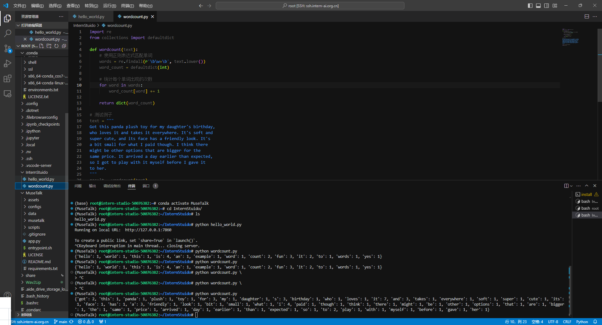
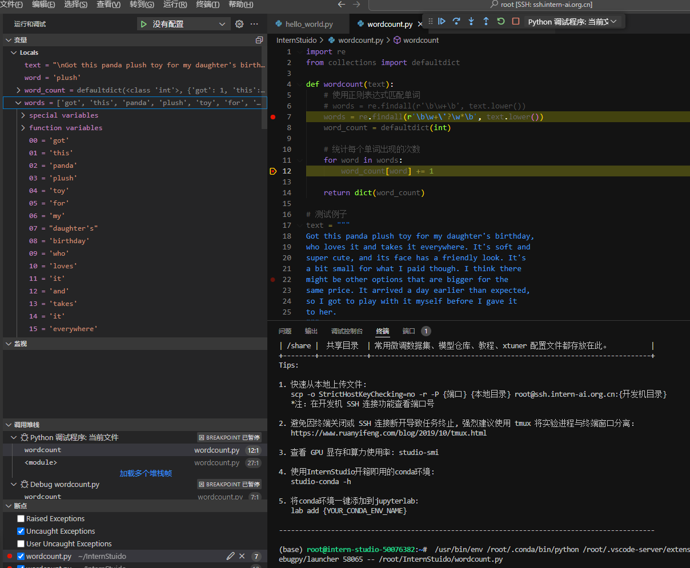
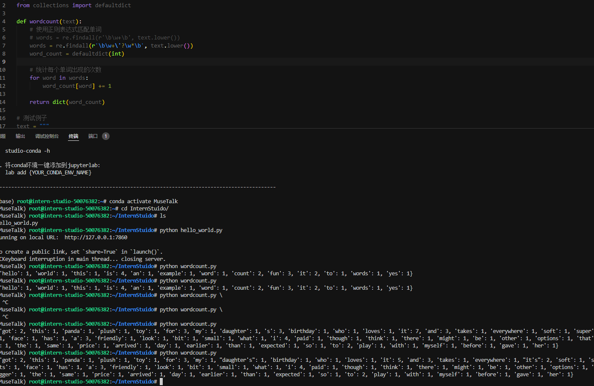

# 任务结果

* **执行wordcount.py**

  

# Debug笔记

1. **设置断点**：在 `wordcount` 函数中设置了断点，方便检查每一步执行情况。

2. **启动调试**：在使用调试配置文件启动调试模式，并成功在断点处暂停。

   

3. **检查变量**：在调试过程中，使用调试控制台检查了变量 `words` 和 `word_count` 的值，确保匹配和统计正确。

4. **问题解决**：在测试过程中发现一个问题：正则表达式没有考虑到单引号的情况（如 `it's`），更新正则表达式为 `r'\b\w+\'?\w*\b'` 后问题解决。

   

5. **最终结果**：调试完成后，程序正确统计每个单词的出现次数，并输出预期结果。