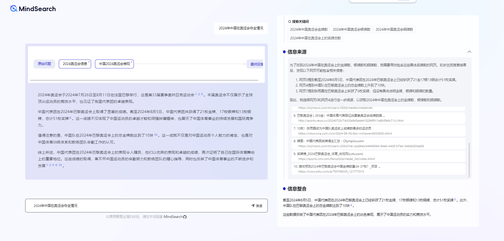
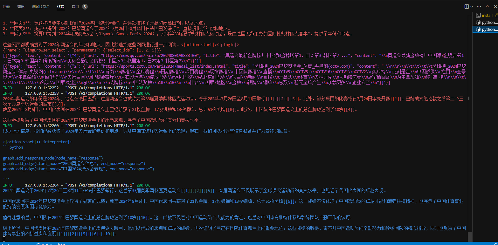

# MindSearch 快速部署及体验

MindSearch（欢迎 Star）：https://github.com/InternLM/MindSearch 

## 1. 问答效果展示

**先贴一个问答的效果：**



功能很强大，挺有趣的。

**再贴一个后台的打印输出！**




## 2. 部署使用（的 Bing 的接口）

选择书生算力平台 50% A100 的 cuda 12.2 的开发机，一定要通过ssh vscode 远程连接到开发机。

不然会访问不了！不然会访问不了！不然会访问不了！
通过[教程](https://github.com/InternLM/Tutorial/tree/camp3/docs/EasterEgg/MindSearch)的提示，我直接选择了Bing的接口

Bing API Key 获取网址（尽量选高一点的定价）：https://www.microsoft.com/en-us/bing/apis/bing-web-search-api

### 2.1 激活环境

小助手提前帮大家安装好了环境，只需要一步一步按照下面的步骤便可以启动 MindSearch。

```shell
conda activate /share/pre_envs/mindsearch
```

### 2.2. 启动后端

打开新终端运行以下命令启动推理后端，本地用vscode ssh连接了开发机，vscode会自动将端口映射到本地 8002 端口。

```shell
export BING_API_KEY='替换你的APIKey'
```

```shell

cd /share/demo/MindSearchBing

python -m mindsearch.app --lang cn --model_format internstudio_server
```

### 2.3. 启动前端

打开新终端运行以下命令启动前端，本地用vscode ssh连接了开发机，vscode会自动将端口映射到本地7860 端口。


```shell
conda activate /share/pre_envs/mindsearch
cd /share/demo/MindSearchBing

python run.py
```
配置正确后即可愉快的玩耍了！
